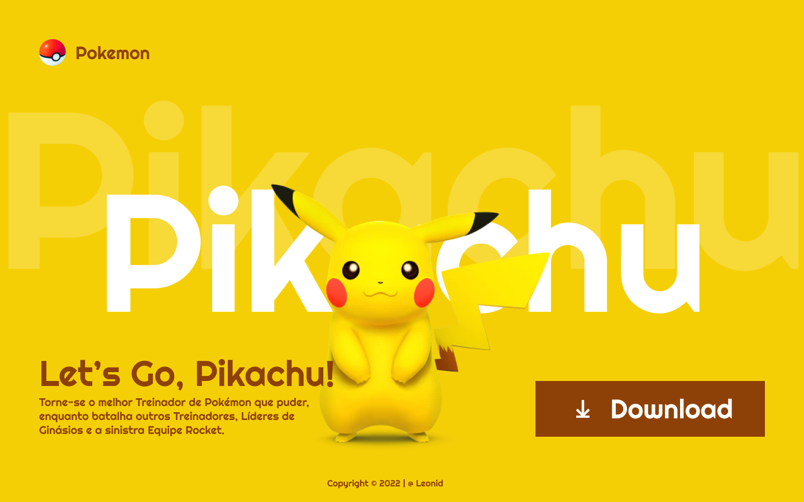

# Landing Page - Let's Go, Pikachu

---
## Sobre
Site do tipo landing page para divulgar o jogo Let's Go, Pikachu. 
O objetivo desse projeto é colocar em prática os conhecimentos adquiridos sobre linguagem de marcação, durante o curso de desenvolvimento de sistema do [SENAI Jandira] (https://sp.senai.br)
O projeto possui outras 3 páginas, onde há o direcionamento através de link na pagina principal.

---
## Tecnologias Ultilizadas 
- HTML
- CSS
- MARKDOWN
- Git

---
## Autor
- [Ana Julia Macedo](www.linkedin.com/in/ana-júlia-macedo-157990308)